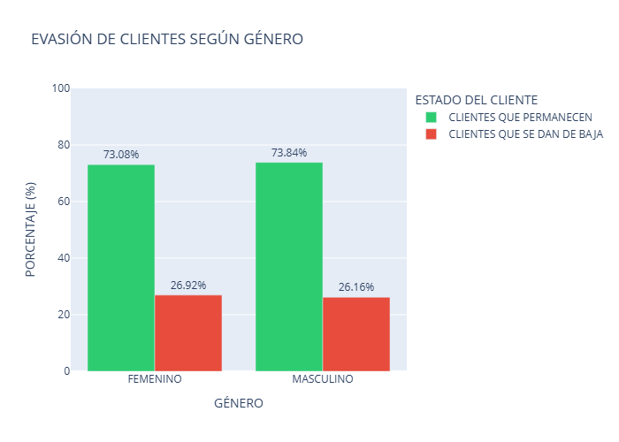
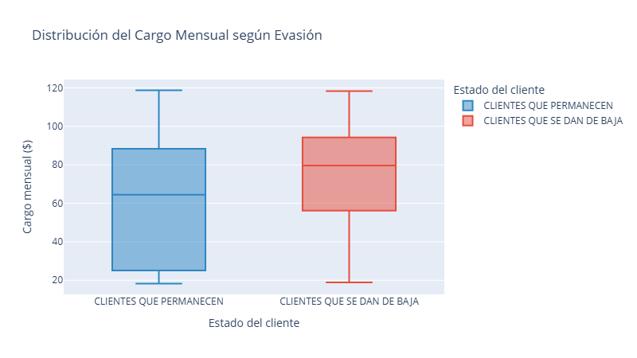

# 📡 Telecom X: Análisis de Evasión de Clientes (Churn)

## 📝 Resumen del Caso
Telecom X enfrenta una alta tasa de cancelaciones de servicio. Como Científico de Datos, mi labor fue identificar los patrones que preceden a la fuga de clientes y proponer estrategias de retención basadas en evidencia estadística.

## 🎯 Objetivos
* Identificar segmentos de clientes con alto riesgo de abandono.
* Analizar la correlación entre costos mensuales y lealtad.
* Proponer un plan de acción para reducir la tasa de Churn en un 15%.

---

## 📈 Visualizaciones y Análisis de Datos

### 1. El Factor del Contrato
El análisis revela que los contratos "Mes a Mes" son el principal punto de fuga.

* **Insight:** Los clientes con contratos a corto plazo tienen una probabilidad de abandono 3 veces mayor que aquellos con contratos anuales.

### 2. Sensibilidad al Precio
Existe un "punto crítico" en los cargos mensuales donde la probabilidad de fuga se dispara.

* **Insight:** Los clientes que pagan entre $70 y $100 USD mensuales son los más propensos a cancelar si no perciben servicios de valor agregado (como soporte técnico).

---

## 🛠️ Metodología Aplicada
1.  **Limpieza Profunda:** Conversión de tipos de datos y manejo de valores nulos en `TotalCharges`.
2.  **EDA (Exploratory Data Analysis):** Segmentación por métodos de pago y servicios adicionales.
3.  **Feature Engineering:** Preparación de variables categóricas para análisis de correlación.

## 💡 Recomendaciones Estratégicas
Tras el análisis, se proponen las siguientes acciones para Telecom X:

1.  **Plan de Migración:** Ofrecer bonos de datos a clientes "Mes a Mes" que migren a contratos de 1 año.
2.  **Optimización de Cobro:** Incentivar el uso de tarjetas de crédito o transferencias bancarias automáticas, ya que el "Cheque Electrónico" presenta la mayor tasa de Churn.
3.  **Fidelización Activa:** Implementar soporte técnico gratuito para el segmento de cargos altos ($70-$100) para aumentar el valor percibido.

---
**Analista:** [Tu Nombre]  
**Proyecto:** Challenge Data Science - Alura Latam
